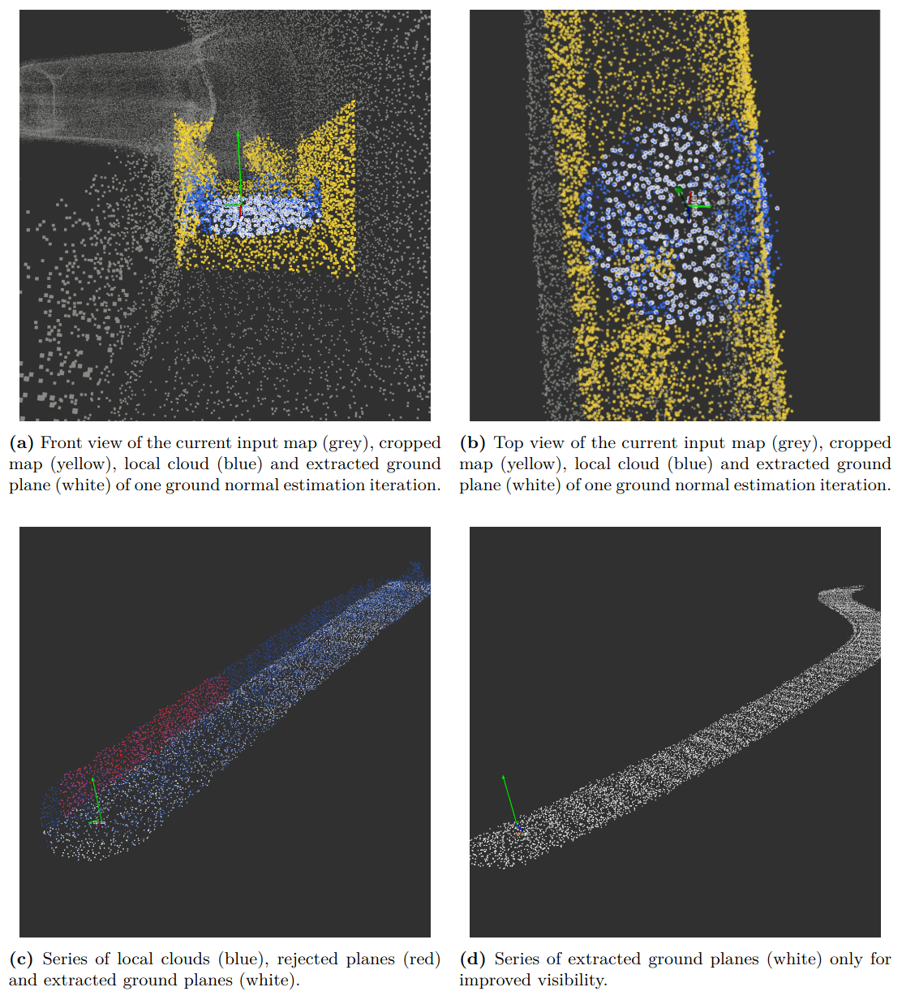

# Global Ground Finder (GGF)

The **Global Ground Finder (GGF)** extracts the current ground normal vector from the latest LIO pose estimate and a continuously-updated global map.

To access the global map directly in memory, the `lio_sphere` node and GGF are structured as nodelets within the `LIO_GF_nodelet_manager`. This avoids the ROS publish-subscribe overhead that would otherwise be present when passing around the large point clouds that make up the global map. See the image below for an illustration.

## Workflow

1. **Crop** — The GGF crops the global map around the current pose to reduce the number of irrelevant points.
2. **Local cloud extraction** — A `local_cloud` is determined via a radius search on a KD-tree. This either uses a static extraction/search radius (`1 m` by default) or a set of search radii, starting from the lowest and increasing if no valid plane is detected.
3. **Plane fitting** — The RANSAC-PCA algorithm determines the ground plane and its normal from the `local_cloud`, as proposed by Carolin Bösch in the Ground Finder (GF).
4. **Validation** — The plane is validated using one or more of the following approaches: angle-based, eigenvalue/eigenvector-based, centroid-based, and mean-Z-axis-deviation-based. By default, only **ground-plane-angle-based** validation is active.
5. **Smoothing** — The found normal is smoothed using a Gaussian kernel filter.
6. **Scoring** — The normal is scored using a visibility score and an inlier score.
7. **Publishing** — The result is published on:
   - `/global_ground_finder/normal`
   - `/global_ground_finder/smoothed_normal`
   - `/global_ground_finder/scored_normal`
   - `/global_ground_finder/smoothed_scored_normal`

Currently, the IMU-based pose estimation filter uses the normal from a configurable topic for pose estimation, and optionally for motion-acceleration compensation.

## Launch Parameters
 
| Parameter | Default | Category | Functionality |
|---|---|---|---|
| `quiet` | `false` | General / Debug | Suppress repetitive `global_ground_finder` logs |
| `ggf_debug` | `false` | General / Debug | Enable `DBG` `ROS_INFO` traces in `global_ground_finder` |
| `debug_publish` | `true` | General / Debug | Publish rejected intermediate inlier clouds for debugging |
| `publish_shared_map_debug_` | `false` | General / Debug | Publish singleton shared map on the GGF side |
| `plane_algorithm` | `ransac` | Algorithm | Ground plane algorithm: `pca` \| `ransac` \| `rht` \| `rht2` |
| `pose_topic` | `/all_pose_out` | Algorithm | Topic providing the current pose estimate |
| `extraction_radius` | `1.0` | Local Map Extraction | Local map extraction radius, in meters |
| `use_adaptive_extraction_radius` | `false` | Local Map Extraction | Use a sphere-radius-based adaptive extraction radius |
| `extraction_height` | `0.5` | Local Map Extraction | Vertical extraction limit, in meters |
| `enable_scoring` | `true` | Scoring | Enable scored normal output and fallback logic |
| `score_threshold` | `0.1` | Scoring | Minimum acceptable score for the current normal |
| `min_score_window` | `0.3` | Scoring | Minimum fallback score from the history window |
| `inlier_scale` | `0.5` | Scoring | Inlier ratio scale for scoring; higher = stricter threshold for `inlier_score = 1.0` |
| `enable_normal_smoothing` | `true` | Smoothing | Enable smoothing for estimated normals |
| `use_gaussian_smoothing` | `true` | Smoothing | Use Gaussian smoothing instead of EMA |
| `normal_smoothing_alpha` | `0.526602` | Smoothing | EMA alpha parameter |
| `smoothing_cutoff_freq` | `2.5` | Smoothing | Gaussian cutoff frequency, in Hz |
| `update_rate` | `20.0` | Smoothing | Expected update rate, in Hz |
| `timing_csv_enabled` | `false` | Logging | Enable timing CSV logging |
| `timing_csv_file` | `$(env HOME)/catkin_ws/src/global_ground_finder/data/timings.csv` | Logging | Timing CSV file path |
| `file` | `default` | Logging | CSV filename base; `default` disables logging |
| `enable_plane_angle_validation` | `true` | Validation Toggle | Enable angle-based wall rejection |
| `enable_eigenvalue_validation` | `false` | Validation Toggle | Enable eigenvalue ratio and eigenvector Z-component checks |
| `enable_z_mean_validation` | `false` | Validation Toggle | Enable Z-mean deviation check |
| `enable_plane_centroid_validation` | `false` | Validation Toggle | Enable plane centroid distance check |
| `eigenvalue_ratio_threshold` | `0.1` | Validation Threshold | Threshold for λ₃/(λ₁+λ₂) planarity check |
| `max_eigenvector_z_component` | `0.3` | Validation Threshold | Max Z-component of dominant eigenvectors (v1, v2) — use `0.2` if the environment has slope |
| `max_centroid_distance` | `0.25 * extraction_radius` | Validation Threshold | Max 3D distance from the robot to the centroid center [m]. Defaults to 25% of `extraction_radius` |
| `max_z_deviation` | `0.2` | Validation Threshold | Max deviation of Z-mean from robot Z [m]. Also limits vertical spread (max Z-spread is twice this value) |

## Future Work

As the GGF improves robustness and accuracy of the GF and is still real-time applicable, the main focus should lie on further improving the GGF, especially on the adaptive search radius approach, as it has the largest potential for dynamic applicability for different environments. Future work should test more search radii, define new scoring parameters so theGGF can be more robust and use the fallback more often. Furthermore, the main dependency in accuracy and robustness is the pose and map output by the `lio_sphere` nodelet.

## Illustration

